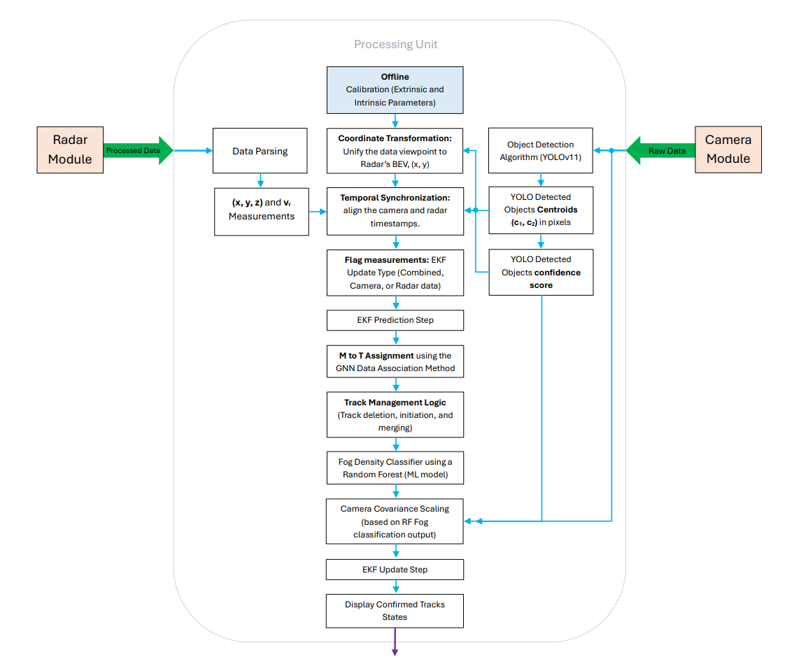

<h3>Welcome to my portfolio!</h3>

 I’m an Electrical Engineering student with a passion for circuits, signal processing, and applied electromagnetics. I lead projects from theory to implementation, breaking complex problems into modules, guiding team members, and diving deep into research to fully understand systems before building them. 

<h4>🚀 Senior Design Project </h4>
<ul>
  <li>
    <strong> Radar - Camera Data Fusion for Object Localization and Tracking using the Extended Kalman Filter </strong>: 

    The project is designed to track objects by fusing radar and camera data using an Extended Kalman filter. Asynchronous measurements from radar (position and velocity) and       camera (bounding box centroids) iterativly update the EKF target estimates, while a Global Nearest Neighbor algorithm ensures each measurement is assigned to the correct         track. The system has applications in Advanced Driver Assistance Systems (ADAS). 

    <em>Tools: MATLAB Simulation, Raspberry Pi, EKF, CA motion model, GNN data association method. </em>  
    <a href="https://github.com/Shayma0123/Shayma-Alteneiji/tree/main/Senior%20Design%20Project">View Project</a>  

  </li>
</ul>
  

<h4>📊 Coursework & Simulations</h4>
<ul>
  <li><strong>[Project Name]</strong>: [Brief description emphasizing skills/tools]. <em>Tools: [Tools]</em> <a href="[link]">View</a></li>
  <!-- Add more projects as needed -->
</ul>

<h4>💻 Research & Mini-Projects</h4>
<ul>
  <li><strong>[Project Name]</strong>: [Brief description emphasizing learning or skills]. <em>Tools: [Tools]</em> <a href="[link]">View</a></li>
  <!-- Add more projects -->
</ul>

<h4>⚡ Work-in-Progress / Experimental</h4>
<ul>
  <li><strong>[Project Name]</strong>: [Short description]. <em>Tools: [Tools]</em></li>
</ul>

<h4>🤳 Connect with me:</h4>

Email: <a href="mailto:your.email@example.com">your.email@example.com</a>

Phone: <a href="tel:+1234567890">+1 234 567 890</a>

GitHub: <a href="https://github.com/yourusername">github.com/yourusername</a>

LinkedIn: <a href="https://www.linkedin.com/in/yourprofile/">linkedin.com/in/yourprofile</a>

<h3>Welcome to my portfolio!</h3>

I’m an Electrical Engineering student with a passion for circuits, signal processing, and applied electromagnetics. I lead projects from theory to implementation, breaking complex problems into modules, guiding teams, and diving deep into research to fully understand systems before building them.

<h4>Projects:</h4>
<ul>
  <li><strong>Camera & Radar Calibration:</strong> Thoertical study and Implmentation of Intrinsic and extrinsic calibration (senior design project).</li>
  <li><strong>Interfacing TI IWR 6843 to a Rassberry Pi:</strong> Thorugh procedure invlved and refrenced code (senior design project).</li>
  <li><strong>Sensor Fusion:</strong> MATLAB implementation of camera-radar data fusion for object tracking using EKF and GNN data association method (senior design project).</li>
  <li><strong>Kalman Filter Research:</strong> LS, RLS, and KF methods, including engineering decisions for synchronization, motion models, target tracking methods, and pseudocode (senior design project).</li>
  <li><strong>MATLAB Simulations:</strong> Throughput Analysis of Slotted and Pure ALOHA multiple access protocols with fixed and dynamic Retransmission probablity.</li>
  <li><strong>Control Systems:</strong> System identification and performance analysis of compensated systems.</li>
  <li><strong>Undergraduate Research Course:</strong> Tasks implemented as part of a project on designing a Pssive Radar System including theortical study, Derivations of related Eqs., and MATLAB simulations.</li>
  <li><strong>Active Noise Cancellation:</strong> Work-in-progress real-time implementation for headphones.</li>
  <li><strong>FPGA Project:</strong> Elevator controller for a four-floor using a finite state machine.</li>
  <li><strong>Electrical Machines:</strong> Implmented an experiment to synchronize a synchronous generator to a grid (load).</li> 
  <li><strong>Electronic Circiuts Design:</strong> Designed and simulated an astable multivibrator circuit using (BJTs) to implement a police siren light.</li>
  <li><strong> COMSOL Assignment:</strong> Simulated a simple electrode system and analyzing deign effects on Electric field and breakdown voltage.</li>
  <li><strong> Microprocassor System Project:</strong> Interfaced a 4x4 matrix keypad with the FRDM KL25Z microcontroller to develop a key-scanning program.</li>
</ul>

<h4>🤳 Connect with me:</h4>

Email: 100063072@ku.ac.ae 

Phone: +971 56 8959 611 

